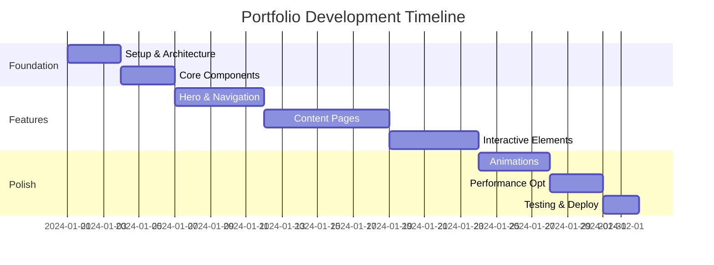

# **Senior Frontend Portfolio Showcase: Next.js 15 Project Specification**

Role: Senior Frontend Software Engineer with 3+ years of experience.

## **Executive Summary**

Create a cutting-edge personal portfolio that demonstrates mastery of modern frontend development through innovative interactions, performance optimization, and exceptional user experience. This project should serve as both a technical showcase and a compelling narrative of your professional journey.

## **Project Vision**

- **Theme**: Minimalistic futurism with sophisticated micro-interactions
- **Target Audience**: Tech recruiters, potential clients, and fellow developers
- **Key Differentiators**: Performance-first approach, accessibility excellence, and memorable user experience

## **Technical Architecture**

### **Core Stack**

```yaml
Framework: Next.js 15 (App Router)
Language: TypeScript (strict mode)
Styling: Tailwind CSS 4 + CSS Variables
Components: shadcn/ui (customized)
Animation: Framer Motion + CSS animations
Icons: @fortawesome/react-fontawesome
State: Zustand (for complex interactions)
Testing: Vitest + React Testing Library
Deployment: Vercel Edge Functions
```

### **Performance Requirements**

- Lighthouse Score: 95+ across all metrics
- First Contentful Paint: < 1.2s
- Time to Interactive: < 2.5s
- Cumulative Layout Shift: < 0.1

## **Enhanced Project Structure**

```
my-portfolio/
├── app/
│   ├── (site)/         # Group route for public pages
│   │   ├── page.tsx         # Landing page
│   │   ├── about/page.tsx   # Dedicated about page
│   │   └── contact/page.tsx # Contact with form
│   ├── (work)/           # Group route for content
│   │   ├── blog/
│   │   │   ├── page.tsx
│   │   │   ├── [slug]/page.tsx
│   │   │   └── tags/[tag]/page.tsx
│   │   ├── projects/
│   │   │   ├── page.tsx
│   │   │   ├── [slug]/page.tsx
│   │   │   └── category/[category]/page.tsx
│   │   └── lab/            # Experimental features
│   │       ├── page.tsx
│   │       └── [experiment]/page.tsx
│   ├── api/
│   │   ├── og/route.tsx    # Dynamic OG images
│   │   └── analytics/route.ts
│   └── layout.tsx
├── components/
│   ├── ui/                  # Extended shadcn components
│   ├── patterns/           # Reusable design patterns
│   ├── animations/         # Animation primitives
│   └── analytics/          # Analytics components
├── lib/
│   ├── hooks/              # Custom React hooks
│   ├── utils/              # Utility functions
│   └── services/           # API integrations
├── content/                # MDX content
│   ├── projects/
│   └── snippets/
└── tests/                  # Test suites
```

## **Feature Specifications**

### **1. Advanced Hero Section**

```typescript
interface HeroFeatures {
  interactiveBackground: 'particle-field' | 'fluid-simulation'
  textAnimation: 'typewriter-glitch' | 'morphing-text'
  ctaTracking: boolean
  personalization: {
    timeOfDay: boolean
    returningVisitor: boolean
  }
}
```

### **2. Smart Content Management**

- **Dynamic Tag System**: Auto-generate related content suggestions
- **Reading Time**: Calculate and display estimated reading time
- **Progress Indicators**: Show reading/viewing progress
- **Content Analytics**: Track engagement metrics

### **3. Interactive Project Showcases**

```typescript
interface ProjectShowcase {
  media: {
    type: 'video' | 'interactive-demo' | 'image-gallery'
    lazyLoad: boolean
    optimizedFormats: string[]
  }
  metrics: {
    impact: string
    performance: number[]
    testimonials: Testimonial[]
  }
  techStack: {
    category: string
    items: Tech[]
    interactiveDemo?: boolean
  }
}
```

### **4. Developer Experience Features**

- **Code Playground**: Embedded interactive code samples using Monaco Editor
- **API Documentation**: Interactive API explorer for your projects
- **Performance Monitor**: Real-time performance metrics display
- **Theme Customizer**: Live theme editing for visitors

## **Animation & Interaction Specifications**

### **Micro-interactions**

```typescript
const interactionConfig = {
  cursor: {
    magnetic: true,
    trailEffect: 'gradient',
    contextualMorph: true,
  },
  scrollBehavior: {
    smoothness: 0.08,
    parallaxLayers: 3,
    revealThreshold: 0.15,
  },
  transitions: {
    pageChange: 'morphing-blob',
    contentReveal: 'stagger-blur',
    hover: 'elastic-scale',
  },
}
```

### **Advanced Animations**

1. **Scroll-Triggered Sequences**: Multi-step animations with timeline control
2. **GPU-Accelerated Effects**: Use `will-change` and transform3d
3. **Gesture Recognition**: Swipe, pinch, and drag interactions
4. **Sound Design**: Optional subtle audio feedback

## **Data Architecture**

### **Content Strategy**

```typescript
interface ContentSchema {
  metadata: {
    seo: SEOConfig
    social: SocialConfig
    analytics: AnalyticsConfig
  }
  content: {
    format: 'mdx' | 'json' | 'yaml'
    version: string
    lastModified: Date
  }
  relationships: {
    related: string[]
    series?: string
    prerequisites?: string[]
  }
}
```

### **API Integrations**

- **GitHub**: Display contribution graph and project statistics
- **Dev.to/Hashnode**: Cross-post blog content
- **Analytics**: Privacy-focused analytics (Plausible/Umami)
- **Newsletter**: ConvertKit/Buttondown integration

## **Performance Optimizations**

### **Build-time Optimizations**

- Static generation for all possible pages
- Incremental Static Regeneration for dynamic content
- Image optimization with Next.js Image component
- Font subsetting and preloading

### **Runtime Optimizations**

- Route prefetching based on user behavior
- Service Worker for offline functionality
- WebAssembly for compute-intensive animations
- Resource hints (preconnect, dns-prefetch)

## **Accessibility Standards**

- WCAG 2.1 AAA compliance
- Keyboard navigation with visible focus indicators
- Screen reader announcements for dynamic content
- Reduced motion alternatives
- Color contrast ratios > 7:1

## **SEO & Marketing**

### **Technical SEO**

```typescript
interface SEOStrategy {
  structured_data: {
    person: boolean
    breadcrumbs: boolean
    articles: boolean
    portfolio: boolean
  }
  meta_tags: {
    dynamic_og_images: boolean
    twitter_cards: 'summary_large_image'
    canonical_urls: boolean
  }
  performance: {
    core_web_vitals: 'green'
    mobile_first: true
  }
}
```

## **Testing & Quality Assurance**

### **Testing Strategy**

```yaml
Unit Tests: Component logic and utilities
Integration Tests: Page interactions and API calls
E2E Tests: Critical user journeys
Visual Regression: Percy/Chromatic integration
Performance Tests: Lighthouse CI
Accessibility Tests: axe-core automation
```

## **Deployment & DevOps**

### **CI/CD Pipeline**

```yaml
Pre-deployment:
  - Type checking
  - Linting & formatting
  - Test suites
  - Bundle analysis
  - Security scanning

Deployment:
  - Preview deployments for PRs
  - Staging environment
  - Production with rollback capability
  - Edge function deployment
  - CDN cache invalidation

Post-deployment:
  - Smoke tests
  - Performance monitoring
  - Error tracking (Sentry)
  - Analytics verification
```

## **Success Metrics**

- Portfolio views → job interviews conversion rate
- Average session duration > 3 minutes
- Project detail page engagement > 60%
- Contact form submission rate > 5%
- Return visitor rate > 30%

## **Bonus Features**

1. **AI Chat Assistant**: Answer questions about your experience
2. **AR Business Card**: WebXR-powered interactive card
3. **Code Time Tracker**: Show your coding activity heatmap
4. **Client Portal**: Password-protected area for client deliverables
5. **RSS Feed**: For blog subscribers
6. **Web Mentions**: Display social media interactions

## **Development Timeline**



This enhanced prompt provides a comprehensive blueprint for creating a truly exceptional portfolio that goes beyond typical showcases. It emphasizes performance, user experience, and technical excellence while maintaining the minimalistic and futuristic aesthetic you desire.
